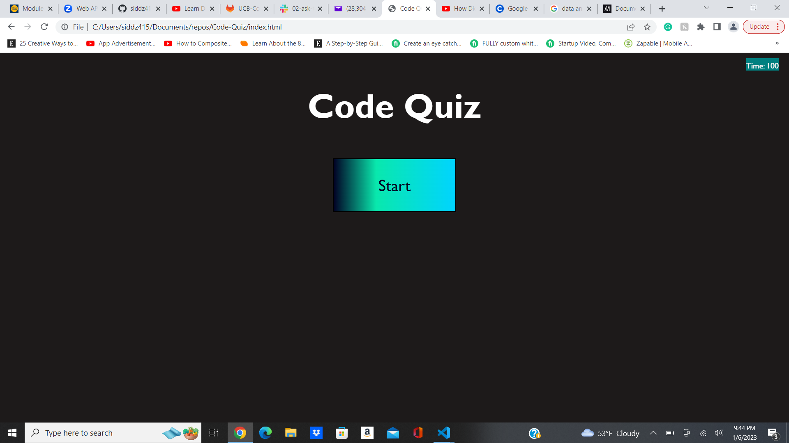

# Code-Quiz
# Description
I have created a quiz with four questions and a timer that deducts 10 seconds from every wrong question. When you click on the start button the timer starts and you are presented with a question, after you answer a question then you are presented with another question. When all questions are answered or the timer reaches 0 then the quiz is over and you can save your name and score in highscore.

## Github Repo Link
https://github.com/siddz415/Code-Quiz

## Github Pages Link
https://siddz415.github.io/Code-Quiz/

## Screenshot
 